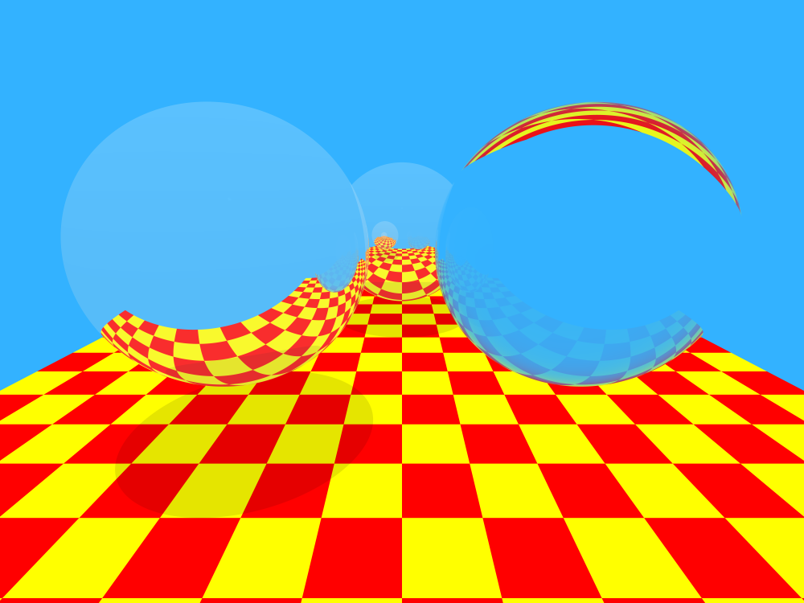

An exercise into ray tracing containing: Blinn-Phong shading, shadows, reflections, refractions, anti-aliasing.
#### Building
* Clone [stb](https://github.com/nothings/stb) into directory `external/stb`.
* Build using CMake.

#### Examples

The above image contains three spheres having properties, from left to right: partially reflective, partially refractive,
 fully transparent. The reflective and refractive spheres reflect and refract a constant fraction of light, the 
 transparent sphere uses the Fresnel equation to determine the reflective and refractive fractions.