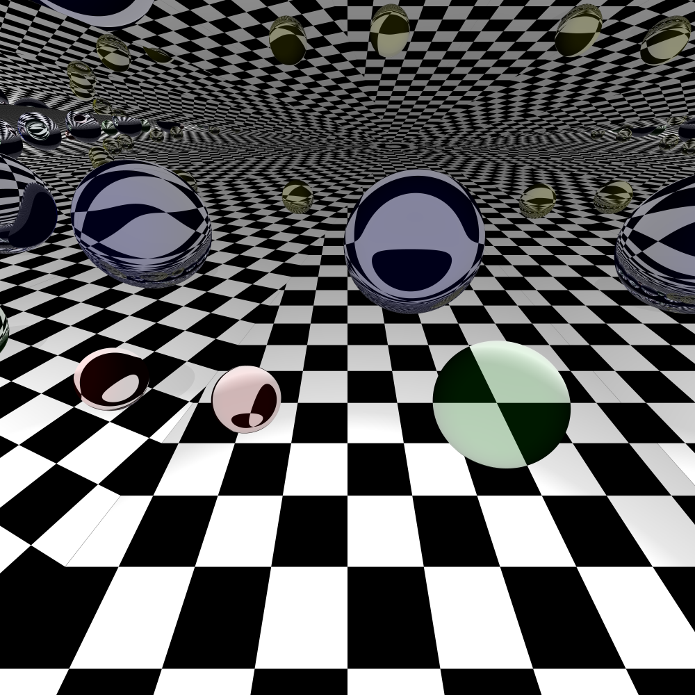

An exercise into ray tracing containing: Blinn-Phong shading, shadows, reflections, refractions, and anti-aliasing. Shadows take into account objects that let light through, and the ratio of reflected and refracted light of transparent objects is dependent on the view angle.

#### Building
* Clone [stb](https://github.com/nothings/stb) into directory `external/stb`.
* Build using CMake.

#### Examples

The above image contains three spheres having the properties, from left to right: partially reflective, partially refractive,
 fully transparent. The reflective and refractive spheres reflect and refract a constant fraction of light, the 
 transparent sphere uses the Fresnel equation to determine the reflective and refractive fractions.
 
The below image contains three fully reflective planes, a checkerboard plane, and four partially refractive spheres.
 

